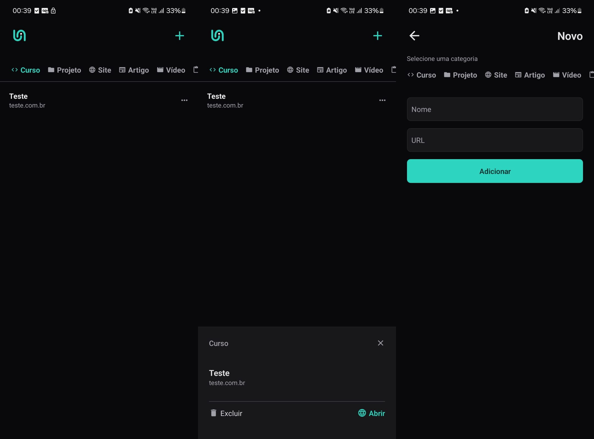

# Project Link



## Descrição

Este é um projeto de aplicativo mobile desenvolvido como um desafio. O projeto consiste em uma aplicação com diversas funcionalidades e componentes reutilizáveis.

## Funcionalidades

- Navegação entre diferentes telas.
- Exibição de listas de itens.
- Integração com armazenamento local.
- Componentes customizados como botões e inputs.

## Tecnologias Utilizadas

- [React Native](https://reactnative.dev)
- [Expo](https://expo.dev)
- [TypeScript](https://www.typescriptlang.org)
- [Next.js](https://nextjs.org)

## Pré-requisitos

- [Node.js](https://nodejs.org/)
- [Expo CLI](https://docs.expo.dev/more/expo-cli/)

## Instalação e Execução

Siga estas etapas para rodar o projeto na sua máquina local:

1. **Clone o repositório:**

   ```bash
   git clone https://github.com/beater27032001/react-native-intro-course-links.git
   cd react-native-intro-course-links
   ```

2. **Instale as dependências:**

   ```bash
   npm install
   ```

3. **Rode o aplicativo:**

   ```bash
   expo start
   ```

4. **Abra o aplicativo no seu dispositivo ou emulador:**

   - Escaneie o QR code com o aplicativo Expo Go no seu dispositivo móvel.
   - Ou escolha a opção de emulador no terminal.
